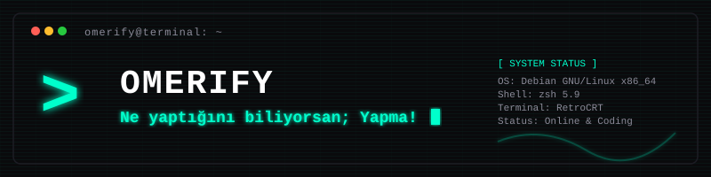

#

  

  
  
  

### 🛠️ Teknolojiler & Araçlar

  
  
  
  
  
  
  
  

### 📈 GitHub İstatistikleri

  
  

  

### 🔗 Sosyal Medya

  
  
  
  
  

---

  <i>"Ne yaptığını biliyorsan; Yapma!"</i>

